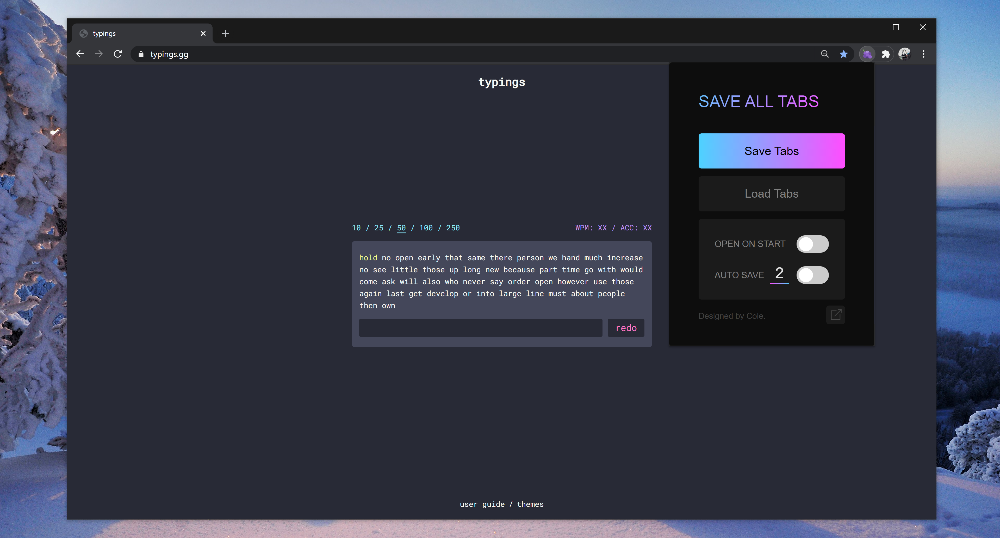

# save_all_tabs

## Overview:

A Chrome Extension that saves all currently opened tabs in local storage on chrome close, then re-opens them the next time chrome opens.

## Chrome Web Store:

You can now download the official extension from the Chrome Web Store - [HERE](https://chrome.google.com/webstore/detail/save-all-tabs/nflekaoakegjcogmjhnfdfijhmhmneim)

## Manual Installation:

-   Download the above files from the repository and save them in a single file named save_all_tabs
-   Go to your chrome extensions page. You can paste this in your URL bar to get there: [chrome://extensions/](chrome://extensions/)
-   Make sure you flick the switch that says Developer Mode to ON
-   You should now see a button near the top that says "Load Unpacked". Click this to import the extension, then find the corresponding folder you created on your computer with the repository's code in it.
-   Thats it, you should now be seeing this extension as an icon in your extensions menu. You can now save and load all tabs in a single click!

## Features:

### Save Tabs:

Saves all current tabs in all currently opened Chrome windows.

### Load Tabs:

Opens your previously saved Chrome tabs in the exact same window layout they were in when you saved them originally.

### Auto Open on Start:

On/Off switch to specify if the user wants their previously saved tabs to automatically be opened when launching chrome after restart.

### Auto Save Tabs:

Periodically saves all your currently tabs. There's an input box which allows the user to specify the auto save frequency if experiencing any processing / networking delays.

### Export Tabs to Chrome Bookmarks:

Exports all currently open Chrome tabs into a Chrome Bookmarks folder. Default folder will be created as SAVE ALL TABS at the highest bookmarks level.
